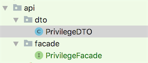

# API接口层开发

## 包结构




## DTO开发规范

```
/**
 * .
 *
 * @author linzhiqiang
 * @version Revision 1.0.0
 * @版权： 版权所有 (c) 2011
 * @see:
 * @创建日期： 2018/7/14
 * @功能说明：
 */
public class PrivilegeDTO extends BaseDTO {
    //属性
    //Getter Setter方法
}
```
+ 说明：
    + 1. 必须以DTO结尾
    + 2. 必须继承BaseDTO或者业务根据BaseDTO继承出来的基类，如：
    
```
/**
 * .
 *
 * @author linzhiqiang
 * @version Revision 1.0.0
 * @版权： 版权所有 (c) 2011
 * @see:
 * @创建日期： 2018/7/14
 * @功能说明：
 */
public class OrderBaseDTO extends BaseDTO {
    //属性
    //Getter Setter方法
}
```
```
/**
 * .
 *
 * @author linzhiqiang
 * @version Revision 1.0.0
 * @版权： 版权所有 (c) 2011
 * @see:
 * @创建日期： 2018/7/14
 * @功能说明：
 */
public class CustomerOrderDTO extends OrderBaseDTO {
    //属性
    //Getter Setter方法
}
```

##Facade接口规范

```
/**
 * .
 *
 * @author linzhiqiang
 * @version Revision 1.0.0
 * @版权： 版权所有 (c) 2011
 * @see:
 * @创建日期： 2018/7/14
 * @功能说明：
 */
public interface PrivilegeFacade extends IBaseFacade {
    //接口方法
    List<PrivilegeDTO> queryAllPrivilege();
}
```
+ 说明：
    + 1. 必须是接口
    + 2. 必须以Facade结尾
    + 2. 必须继承IBaseFacade或者业务根据IBaseFacade继承出来的基接口.
    


