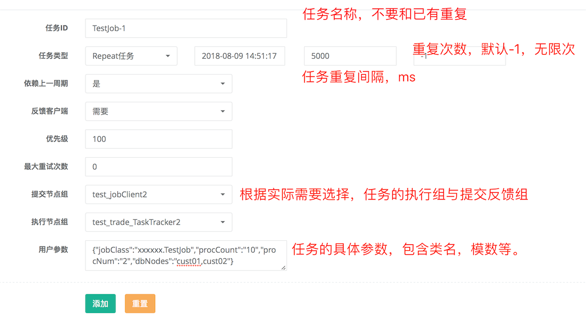

# 定时任务开发使用规范
## 简介

定时任务主要基于LTS（light-task-scheduler）进行封装改造
相关的文档介绍参考：[light-task-scheduler](https://github.com/ltsopensource/light-task-scheduler)

## 开发前提
+ 1、部署相应的组件：Lts-admin，Lts-jobtracker
+ 2、配置集群名称 ：clusterName=test_cluster，后续应用配置也要维持一致。

## 包引入
maven引入包
```
 <dependency>
            <groupId>com.shtel.bss.core</groupId>
            <artifactId>framework-core-job-runner</artifactId>
            <version>x.y.z</version>
        </dependency>
```

## 配置SpringBoot属性
```
##和前面说明的集群名称相同
lts.tasktracker.cluster-name=test_cluster
##zk地址
lts.tasktracker.registry-address=zookeeper://127.0.0.1:2181
##工作线程，可以根据需要进行调整，默认64
#lts.tasktracker.work-threads=64
##分组名称，根据实际需要填写，后续任务执行时，指定集群。
lts.tasktracker.node-group=test_trade_TaskTracker2
##失败存储方式。leveldb,rocksdb,berkeleydb,mapdb,ltsdb可选
lts.tasktracker.configs.job.fail.store=ltsdb
##执行类，此属性必填
lts.tasktracker.job-runner-class=com.shtel.bss.core.job.JobDispatchRunner

##和前面说明的集群名称相同
lts.jobclient.cluster-name=test_cluster
##zk地址
lts.jobclient.registry-address=zookeeper://127.0.0.1:2181
##分组名称，根据实际需要填写，后续任务执行时，指定集群。
lts.jobclient.node-group=test_jobClient2
lts.jobclient.use-retry-client=true
##失败存储方式。leveldb,rocksdb,berkeleydb,mapdb,ltsdb可选
lts.jobclient.configs.job.fail.store=ltsdb
```

## 开发任务执行类
范例：

```
/**
 * .
 *
 * @author linzhiqiang
 * @version Revision 1.0.0
 * @版权： 版权所有 (c) 2011
 * @see:
 * @创建日期： 2018/8/3
 * @功能说明：
 */
public class TestJob extends BaseJob {
    @Override
    protected void afterDataDeal(JobExecuteContext context, List<Object> dealsDatas, Vector<Object> successDatas, Vector<Object> failedDatas) {
        System.out.println("afterDataDeal:" + dealsDatas);
        System.out.println("successData:" + successDatas);
        System.out.println("failedDatas:" + failedDatas);

    }

    @Override
    protected List<Object> loadDatas(JobExecuteContext context, int procCount,
                                     int procNumber, Set<String> dbNodes) {
        List<Object> list = new ArrayList<>();
        list.add("aaaa");
        list.add("bbbbb");
        list.add("ccccccc");
        System.out.println("loadDatas");
        return list;
    }

    @Override
    protected boolean dealData(JobExecuteContext context, Object t, Map<String, Object> extParams) {
        System.out.printf(t + "");
        if ("bbbbb".equals(t)) {
            return false;
        }
        return true;
    }

    @Override
    protected Map<String, Object> getExtParams(JobExecuteContext context, Object t) {
        System.out.println("getExtParams");
        return null;
    }

}
```
### 第一步：继承BaseJob

```
public class TestJob extends BaseJob {

```
### 第二步：实现方法，实现相应的逻辑，包括取数，单一数据处理，等。
```
/**
     * 方法功能:
     *  第四部，数据全部处理结束后的处理..
     * @param: [context, dealsDatas, successDatas, failedDatas]
     * @return: void
     * @author: linzhiqiang
     * @修改记录：
     * ==============================================================<br>
     * 日期:2018/8/3 linzhiqiang 创建方法，并实现其功能
     * ==============================================================<br>
     */
    protected abstract void afterDataDeal(JobExecuteContext context, List<Object> dealsDatas,
        Vector<Object> successDatas, Vector<Object> failedDatas);
    
    /**
     * 方法功能:
     *  第一步获取数据.
     * @param: [context]
     * @return: java.util.List<java.lang.Object>
     * @author: linzhiqiang
     * @修改记录：
     * ==============================================================<br>
     * 日期:2018/8/3 linzhiqiang 创建方法，并实现其功能
     * ==============================================================<br>
     */
    protected abstract List<Object> loadDatas(JobExecuteContext context, int procCount,
        int procNumber, Set<String> dbNodes);
    
    /**
     * 方法功能:
     *  处理每条数据.
     * @param: [context, t, extParams]
     * @return: boolean
     * @author: linzhiqiang
     * @修改记录：
     * ==============================================================<br>
     * 日期:2018/8/3 linzhiqiang 创建方法，并实现其功能
     * ==============================================================<br>
     */
    protected abstract boolean dealData(JobExecuteContext context, Object t,
        Map<String, Object> extParams);
    
    /**
     * 方法功能:
     *  第二步，生成每个对象的附加处理属性.
     * @param: [context, t]
     * @return: java.util.Map<java.lang.String,java.lang.Object>
     * @author: linzhiqiang
     * @修改记录：
     * ==============================================================<br>
     * 日期:2018/8/3 linzhiqiang 创建方法，并实现其功能
     * ==============================================================<br>
     */
    protected abstract Map<String, Object> getExtParams(JobExecuteContext context, Object t);
    
```

## 任务配置


### 参数说明
{
"jobClass":"xxxxxx.TestJob", 任务执行类名，可以执行类全路径，或者使用$开头，如 $beanName，执行SpringBean
"procCount":"10", 取模的模数
"procNum":"2", 取模后的模值
"dbNodes":"cust01,cust02" 分片列表
}

## 附加开发
### 任务完成反馈处理
可以根据需要，定制任务反馈的处理。
+ 第一步：实现接口IJobCompleteHandler
+ 第二步：实现OnComplete方法
+ 第三步：注解@Component
+ 范例：
```
/**
 * .
 *
 * @author linzhiqiang
 * @version Revision 1.0.0
 * @版权： 版权所有 (c) 2011
 * @see:
 * @创建日期： 2018/8/9
 * @功能说明：
 */
@Component
public class TestJobCompleteHandler implements IJobCompleteHandler {
    @Override
    public void onComplete(JobResult jobResult) {
        System.out.println("~~~~~~~完成~~~~~" + jobResult);
    }
}
```


