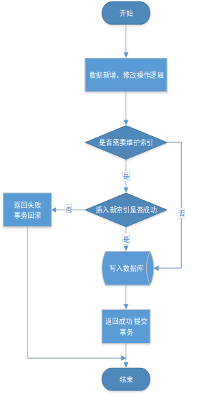
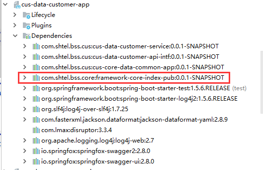
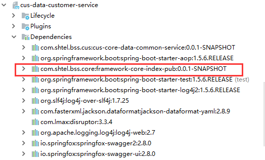
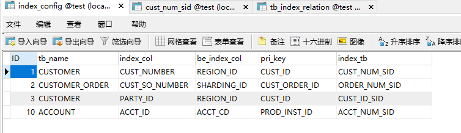
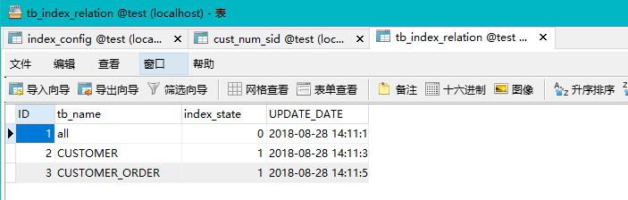
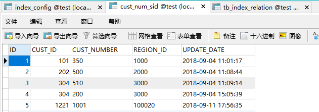

# 索引模块操作手册

# 一、说明

索引模块：在增删改操作前，发起全局索引维护操作，保证索引数据比数据库数据准确，直接调用索引API查询索引，简化研发人员说使用索引逻辑。

# 二、流程图

## **索引维护流程图：**

索引维护是在应用操作数据，对数据进行新增及修改的操作之前，根据操作的数据库表从索引配置表中查询是否需要维护索引，需要进行索引维护则根据索引配置表的内容将新索引插入对应的索引表中，完成新索引的维护。

## **索引API查询流程图：**

# 三、操作说明

## **1、添加maven依赖**

在cus-parent项目pom中添加索引模块依赖

&lt;dependency&gt;

&lt;groupId&gt;com.shtel.bss.core&lt;\/groupId&gt;

&lt;artifactId&gt;framework-core-index-pub&lt;\/artifactId&gt;

&lt;version&gt;${framework-core.version}&lt;\/version&gt;

&lt;/dependency&gt;

在cus-data-customer-app项目pom中添加索引模块依赖

&lt;dependency&gt;

&lt;groupId&gt;com.shtel.bss.core&lt;\/groupId&gt;

&lt;artifactId&gt;framework-core-index-pub&lt;\/artifactId&gt;

&lt;/dependency&gt;

在cus-data-customer-service项目pom中添加索引模块依赖

&lt;dependency&gt;

&lt;groupId&gt;com.shtel.bss.core&lt;\/groupId&gt;

&lt;artifactId&gt;framework-core-index-pub&lt;\/artifactId&gt;

&lt;/dependency&gt;

重新编译项目，看Dependencies中是否导入framework-core-index-pub:0.0.1-SNAPSHOT jar包

如图：

## **2、创建数据库表**

### ** a.索引配置表：**

drop table if exists index\_config;

CREATE TABLE IF NOT EXISTS \`index\_config\` \(

\`ID\` int\(11\) NOT NULL AUTO\_INCREMENT,

\`tb\_name\` varchar\(100\) COLLATE utf8mb4\_bin NOT NULL COMMENT '表名',

\`index\_col\` varchar\(100\) COLLATE utf8mb4\_bin NOT NULL COMMENT '索引列',

\`be\_index\_col\` varchar\(100\) COLLATE utf8mb4\_bin NOT NULL COMMENT '被索引列',

\`pri\_key\` varchar\(100\) COLLATE utf8mb4\_bin NOT NULL COMMENT '主键',

\`index\_level\` tinyint\(4\) NOT NULL COMMENT '索引优先级：0为高级：将进行索引操作、 1为低级：将不做索引维护',

\`index\_tb\` varchar\(300\) COLLATE utf8mb4\_bin NOT NULL COMMENT '索引表名称',

PRIMARY KEY \(\`ID\`\)

\)

### **b.索引状态关系表：查询索引开关配置**

drop table if exists tb\_index\_relation;

CREATE TABLE IF NOT EXISTS \`tb\_index\_relation\` \(

\`ID\` bigint\(20\) NOT NULL AUTO\_INCREMENT COMMENT '主键',

\`tb\_name\` varchar\(100\) NOT NULL COMMENT '表名',

\`index\_state\` tinyint\(4\) NOT NULL COMMENT '索引状态：1为开启广播 0为关闭广播',

\`UPDATE\_DATE\` timestamp NULL DEFAULT CURRENT\_TIMESTAMP COMMENT '创建时间',

PRIMARY KEY \(\`ID\`\)

\)

### **c.索引表（样例cust\_num\_sid表，具体按各表内容创建）**

drop table if exists cust\_num\_sid;

CREATE TABLE IF NOT EXISTS \`cust\_num\_sid\` \(

\`ID\` bigint\(20\) NOT NULL AUTO\_INCREMENT COMMENT '主键',

\`CUST\_ID\` bigint\(20\) NOT NULL, \/\/各表对应的主键

\`CUST\_NUMBER\` varchar\(100\) NOT NULL, \/\/各表查询时候传入的索引列

\`REGION\_ID\` varchar\(100\) DEFAULT NULL, \/\/要查询的被索引列

\`UPDATE\_DATE\` timestamp NULL DEFAULT CURRENT\_TIMESTAMP COMMENT '创建时间',

PRIMARY KEY \(\`ID\`\)

\)

## **3、数据库表配置说明**

### **索引配置表样例：（表内容需要根据具体情况填值）**

### **索引关系表样例：**

当从索引关系表查询开光配置时，表中若无该表信息，则所以状态以all字段的index\_state为准，，若all字段对应的索引状态（index\_state）为1，则返回为允许广播，若索引状态为0，则返回不允许广播，所以all字段必须按要求配置。

### **索引表样例：**

## **4、索引API说明**

### **索引API工具类：IndexHelp.java**

**包路径：package com.shtel.bss.core.index.index;**

**getValues\(String tbName, String keyCol, String beIndex, String indexValue, Class&lt;T&gt; clazz\)方法（获取索引值）：**

方法调用：List values = IndexHelper.getValues\("表名","索引列名","被索引列名","索引列值",Class\);

用例：list = IndexHelper.getValues\("cUSTOMER", "CUST\_NUMBER", "REGION\_ID", "350", long.class\);

其中最后的参数long.class为你需要的返回值类型，传入long.class，则返回long类型数据。

### **isAllowBoardcast\(String tbname\) 方法（返回的是允许广播，索引配置是否开启）**

根据传入的表名，查询索引关系表，获取索引状态，并返回。若该表名在索引关系表中未查到数据，则会改查询“all”字段的索引状态，并返回。

### **checkIsNull\(String tbname, List list\) 方法（判断getValue返回值是否为空）**

用例：newlist = IndexHelper.checkIsNull\("CUSTOMER", list\);

checkIsNull方法会调用isAllowBoardcast方法查询传入的，当返回的是允许广播时，则不判断getValue返回值是否为空，直接原值返回。isAllowBoardcast方法返回的是不允许广播时，则判断getValue返回值是否为空，不为空直接原值返回，为空抛出异常错误。

## **5、事务独立**

索引维护为独立事务，并且在索引维护过程中出现异常，会将异常抛出，触发外部事务回滚。索引维护成功后，外部出现异常不会引起索引维护的事务回滚。

# 四、应用使用API说明

## 应用逻辑开发

### 第一步：定义Dao接口方法

custDao.getCustByCustNumber\(String custNumber\);

### 第二步：定义mapper方法

如：

custMapper.getCustByCustNumber\(String custNumber,List&lt;T&gt; valus\)

### 第三步：定义mapper.xml

&lt;select id="getCustByCustSoNumber" resultMap="xxxxMap"&gt;

select

&lt;include refid="XXX\_List" \/&gt;

from customer

where CUST\_NUMBER = \#{custNumber}

&lt;bind name=\"checkIsNull\" value=\"@xxxx.IndexHelper@checkIsNull\("customer",”values\)\"\/&gt;

&lt;if test="null != values and values.size = 1"&gt;

and SHARDING\_ID =

&lt;foreach ...&gt;

....

&lt;/foreach&gt;

&lt;/if&gt;

&lt;if test="null != values and values.size &gt; 1"&gt;

and SHARDING\_ID in

&lt;foreach ...&gt;

....

&lt;/foreach&gt;

&lt;/if&gt;

&lt;/select&gt;

### 第四步：使用平台提供的索引API

List&lt;T&gt; values = IndexHelper.getValues\("表名","索引列名","被索引列名","Key值",Class&lt;T&gt;\);

### 第五步：实现DAO接口方法，逻辑如下：

public List&lt;Cust&gt; getCustByCustNumber\(String custSoNumber\) {

//首先查询索引值

List&lt;T&gt; values = IndexHelper.getValues\("表名","索引列名","被索引列名","Key值",Class&lt;T&gt;\);

//调用mapper

List&lt;Cust&gt; custs = custMapper.getCustByCustNumber\(custNumber,valus\);

return custs

