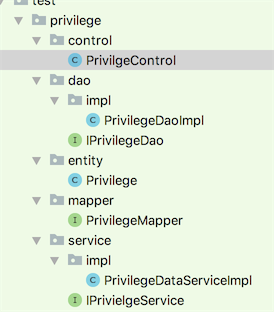

# 基于DAO模式的开发

## 包结构



## Entity开发规范

### 范例

```text
@PartitionTable
@SharedTable
@Table(name = "PRIVILEGE")
public class Privilege extends BaseEntityImpl<Long>
    implements IStatusCdOperator<String>, IPartitionEntity<Date>, ISingleShardingEntity<Long>,
    IVersionEntity<Long> {

    public Privilege() {
    }

    public Privilege(boolean genId) {
        super(genId);
    }

    @Id
    @Column(name = "PRIVILEGE_ID")
    private Long   privilegeId;
    //省略字段

    public Long getPrivilegeId() {
        return privilegeId;
    }

    public void setPrivilegeId(Long privilegeId) {
        this.privilegeId = privilegeId;
    }
    //省略方法

    @Override
    public Long getId() {
        return getPrivilegeId();
    }

    @Override
    public void setId(Long aLong) {
        setPrivilegeId(aLong);
    }

    //省略方法
}
```

### 说明

* 1、必须继承BaseEntity，并定义泛型
* 2、重写getId\(\),setId\(\)方法

## Mapper开发规范

### 范例

```text
/**
 * .
 *
 * @author linzhiqiang
 * @version Revision 1.0.0
 * @版权： 版权所有 (c) 2011
 * @see:
 * @创建日期： 2018/7/6
 * @功能说明：
 */
public interface PrivilegeMapper extends BaseMapper<Privilege> {

    List<Privilege> getPrivilegesByType(String type);
}
```

### 说明

* 1、必须是接口
* 2、必须以Mapper结尾
* 3、必须继承BaseMapper

## DAO开发规范

### 范例

#### 接口

```text
/**
 * .
 *
 * @author linzhiqiang
 * @version Revision 1.0.0
 * @版权： 版权所有 (c) 2011
 * @see:
 * @创建日期： 2018/7/6
 * @功能说明：
 */
public interface IPrivilegeDao extends IBaseDao {

    List<Privilege> getPrivilegesByType(String type);
}
```

* 说明：
  * 1、 继承IBaseDao接口
  * 2、 以Dao结尾

#### 实现

```text
/**
 * .
 *
 * @author linzhiqiang
 * @version Revision 1.0.0
 * @版权： 版权所有 (c) 2011
 * @see:
 * @创建日期： 2018/7/6
 * @功能说明：
 */
@Repository("privilegeDao")
public class PrivilegeDaoImpl extends BaseDaoImpl implements IPrivilegeDao {

    @Override
    public List<Privilege> getPrivilegesByType(String type) {
        PrivilegeMapper mapper = getMapper(Privilege.class);
        return mapper.getPrivilegesByType(type);
    }
}
```

* 说明：
  * 1、 继承BaseDaoImpl

## Service开发规范

### 范例

#### 接口

```text
/**
 * .
 *
 * @author linzhiqiang
 * @version Revision 1.0.0
 * @版权： 版权所有 (c) 2011
 * @see:
 * @创建日期： 2018/7/6
 * @功能说明：
 */
public interface IPrivielgeService extends IGenericService<Privilege, Long> {

    List<Privilege> getPrivilegesByTypeAndStatusCd(String type, String statusCd);
}
```

* 说明：
  * 1、 继承IGenericService
  * 2、 名称以Service结尾

#### 实现

```text
/**
 * .
 *
 * @author linzhiqiang
 * @version Revision 1.0.0
 * @版权： 版权所有 (c) 2011
 * @see:
 * @创建日期： 2018/7/6
 * @功能说明：
 */
@Service("privilegeService")
public class PrivilegeDataServiceImpl extends AbstractGenericServiceImpl<Privilege, Long>
    implements IPrivielgeService {

    @Autowired
    private IPrivilegeDao privielgeDao;

    @Override
    public List<Privilege> getPrivilegesByTypeAndStatusCd(String type, String statusCd) {
        List<Privilege> privileges = privielgeDao.getPrivilegesByType(type);
        List<Privilege> temp = new ArrayList<Privilege>();
        for (Privilege privilege : privileges) {
            if (privilege.getStatusCd().equals(statusCd)) {
                temp.add(privilege);
            }
        }
        return temp;
    }

    @Override
    public IPrivilegeDao getDao() {
        return privielgeDao;
    }
```

* 说明：
  * 1、 继承 AbstractGenericServiceImpl
  * 2、 重写getDao方法，返回对应的Dao。

