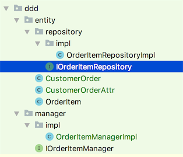

# 基于DDD模式的开发

## 包结构



## Entity开发规范

### 不带纵表的Entity开发

```text
/**
 * .
 *
 * @author linzhiqiang
 * @version Revision 1.0.0
 * @版权： 版权所有 (c) 2011
 * @see:
 * @创建日期： 2018/7/14
 * @功能说明：
 */
public class OrderItem extends AbstractDomBaseEntityImpl<Long> {

    public List<OrderItem> getSubOrderItems() {
        return ((IOrderItemRepository)repository()).querySubOrderItems(this.getId());
    }
}
```

* 说明：
  * 1、 继承AbstractDomBaseEntityImpl

    **带有纵表的Entity开发**

    **CustomerOrder.java**

    ```text
    /**
    * .
    *
    * @author linzhiqiang
    * @version Revision 1.0.0
    * @版权： 版权所有 (c) 2011
    * @see:
    * @创建日期： 2018/7/14
    * @功能说明：
    */
    public class CustomerOrder extends AbstractDomBaseEntityImpl<Long> {
    @Override
    public Class<? extends IMetaAttrEntity> getAttrEntityClazz() {
      return CustomerOrderAttr.class;
    }
    }
    ```
* 说明：
  * 1、 继承AbstractDomBaseEntityImpl
  * 2、 重写getAttrEntityClazz方法，返回动态属性表对应的对象

#### CustomerOrderAttr.java

```text
/**
 * .
 *
 * @author linzhiqiang
 * @version Revision 1.0.0
 * @版权： 版权所有 (c) 2011
 * @see:
 * @创建日期： 2018/7/14
 * @功能说明：
 */
public class CustomerOrderAttr extends AbstractDomBaseAttrEntityImpl<Long> {
    @Override
    public Long getId() {
        return null;
    }

    @Override
    public void setId(Long aLong) {

    }

    @Override
    public Object getOwnerEntityId() {
        return null;
    }

    @Override
    public void setOwnerEntityId(Object ownerEntityId) {

    }

    @Override
    public Object getAttrId() {
        return null;
    }

    @Override
    public void setAttrId(Object attrId) {

    }

    @Override
    public Object getAttrValue() {
        return null;
    }

    @Override
    public void setAttrValue(Object attrValue) {

    }
}
```

* 说明：
  * 1、 继承AbstractDomBaseAttrEntityImpl
  * 2、 重写相应的虚方法

## Repository开发规范

### 范例

#### 接口

```text
/**
 * .
 *
 * @author linzhiqiang
 * @version Revision 1.0.0
 * @版权： 版权所有 (c) 2011
 * @see:
 * @创建日期： 2018/7/14
 * @功能说明：
 */
public interface IOrderItemRepository extends IDomBaseRepository<OrderItem,Long> {

    public List<OrderItem> querySubOrderItems(Long orderItemId);

}
```

* 说明：
  * 1、 继承IDomBaseRepository接口
  * 2、 以Repository结尾

#### 实现

```text
/**
 * .
 *
 * @author linzhiqiang
 * @version Revision 1.0.0
 * @版权： 版权所有 (c) 2011
 * @see:
 * @创建日期： 2018/7/14
 * @功能说明：
 */
@Repository("orderItemRepository")
public class OrderItemRepositoryImpl extends AbstractDomBaseRepositoryImpl<OrderItem, Long> implements IOrderItemRepository {
    public OrderItemRepositoryImpl(Class<OrderItem> repositoryClass) {
        super(repositoryClass);
    }

    @Override
    public List<OrderItem> querySubOrderItems(Long orderItemId) {
        return null;
    }
}
```

* 说明：
  * 1、 继承AbstractDomBaseRepositoryImpl

## Manager开发规范

### 范例

#### 接口

```text
/**
 * .
 *
 * @author linzhiqiang
 * @version Revision 1.0.0
 * @版权： 版权所有 (c) 2011
 * @see:
 * @创建日期： 2018/7/14
 * @功能说明：
 */
public interface IOrderItemManager extends IDomGenericManger<OrderItem, Long> {

    List<OrderItem> getSubOrderItems(OrderItem orderItem);
}
```

* 说明：
  * 1、 继承IDomGenericManger接口
  * 2、 以Manager结尾

#### 实现

```text
/**
 * .
 *
 * @author linzhiqiang
 * @version Revision 1.0.0
 * @版权： 版权所有 (c) 2011
 * @see:
 * @创建日期： 2018/7/14
 * @功能说明：
 */
public class OrderItemManagerImpl extends AbstractDomGenericManagerImpl<OrderItem, Long>
    implements IOrderItemManager {
    @Override
    public List<OrderItem> getSubOrderItems(OrderItem orderItem) {
        return orderItem.getSubOrderItems();
    }
}
```

* 说明：
  * 1、 继承AbstractDomGenericManagerImpl

## 动态属性操作

与主数据模式操作相同

