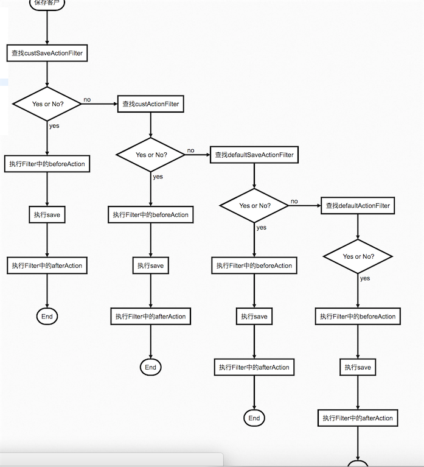

# 通用拦截处理机制

## 对象CRUD拦截器使用说明

### 目标

1. 对象CRUD操作前，判断是否进行处理
2. 用于对象操作前后，对对象进行处理，如公共字段。

### Interceptor拦截链

提供拦截链，当对象多CUD操作时，判断是否对操作进行拦截。

#### 实现方式：

1. 继承虚类com.ffcs.crmd.platform.meta.daaction.interceptor.impl.AbstractDaInterceptor
2. 根据需要重写一个或者多个方法，如果符合条件不拦截，则返回false，需要拦截返回true。

```text
public boolean doSave(DaInterceptorContext context, Object entity) {
   return true;
}

public boolean doUpdate(DaInterceptorContext context, Object entity) {
   return true;
}

public boolean doDelete(DaInterceptorContext context, Object entity) {
   return true;
}
```

1. 注册该类。
2. 方法一：在类上增加@Component注解，Spring自动注册
3. 方法二：静态类调用该类的构造方法。仅需调用一次。

### 注意：

多个拦截器之间的调用，在应用每次启动时，顺序不一定一致，需要注意。

## ActionFilter操作前后拦截处理

用于CUD操作前后进行相关的必要操作。

### 调用顺序

以保存Cust为例



```text
st=>start: 保存客户
e1=>end
e2=>end
e3=>end
e4=>end
op1=>operation: 查找custSaveActionFilter
op2=>operation: 查找custActionFilter
op3=>operation: 查找defaultSaveActionFilter
op4=>operation: 查找defaultActionFilter
op5=>operation: 执行Filter中的beforeAction
op6=>operation: 执行save
op7=>operation: 执行Filter中的afterAction
op25=>operation: 执行Filter中的beforeAction
op26=>operation: 执行save
op27=>operation: 执行Filter中的afterAction
op35=>operation: 执行Filter中的beforeAction
op36=>operation: 执行save
op37=>operation: 执行Filter中的afterAction
op45=>operation: 执行Filter中的beforeAction
op46=>operation: 执行save
op47=>operation: 执行Filter中的afterAction
cond1=>condition: Yes or No?
cond2=>condition: Yes or No?
cond3=>condition: Yes or No?
cond4=>condition: Yes or No?
st->op1->cond1
cond1(yes)->op5->op6->op7->e1
cond1(no)->op2->cond2
cond2(yes)->op25->op26->op27->e2
cond2(no)->op3->cond3
cond3(yes)->op35->op36->op37->e3
cond3(no)->op4->cond4
cond4(yes)->op45->op46->op47->e4
```

### 实现方式

1. 通用拦截
2. 继承com.ffcs.crmd.platform.meta.daaction.filter.impl.AbstractDaActionFilter
3. 注册SpringBean
   * 名称为 defaultActionFilter，适用于save，update，delete
   * 名称为defaultSaveActionFilter，只适用于Save操作
4. 个性化
   * 针对类名或者getEntityName获取到的名称查找
   * 如Cust 对应的为 custActionFilter,custSaveActionFilter

## 历史表个性处理

1. 历史表的操作在AbstractDaActionFilter中做了封装。
2. 应用开发中可以针对部分方法做重写，进行个性化的处理。

### 开发过程

#### 接口说明

```text
/**
* 根据操作类型判断是否需要写历史表操作
* @param context
* @param entity
* @param actionType
* @return
*/
protected boolean isLogHis(DaActionContext context,Object entity,ActionType actionType)；


/**
* 获取默认的历史表记录要求
* 
* @param context
* @param entity
* @param actionType
* @return
*/
protected boolean getDefaultLog(DaActionContext context, Object entity, ActionType actionType)；

/**
* 实际的写历史表操作
* @param context
* @param entity
* @param actionType
* @return
*/
protected RetVo logHistory(DaActionContext context,Object entity,ActionType actionType);
/**
* 获取原始对象
* @param context
* @param entity
* @return
*/
protected Object getOrignEntity(DaActionContext context,Object entity);
```

#### 应用开发过程

1. 应用自定义ActionFilter
2. 重写getDefaultLog方法，该方法确定应用默认的是否记录历史表日志。可以根据《ActionFilter操作前后拦截处理》进行开发
3. 可以根据需要自定义里面的方法进行自定义开发。

